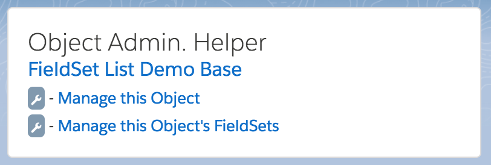
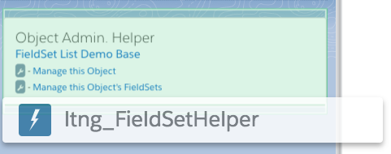
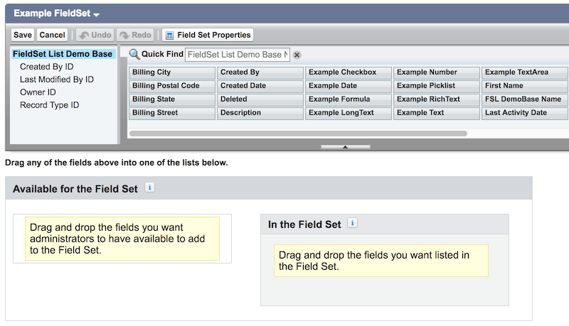

# Overview

How can we use FieldSets within Lightning Experience?

**Please note: sample code (metadata api and dx formats) are available in the [mdapi](./mdapi) and [dx](./dx) folders above. Please see the [Install](#install) section for more detail.**

# FieldSet Helper

Currently, FieldSets are not supported within Lightning Experience.

We've included an additional component called the [FieldSetHelper](dx/force-app/main/default/aura/ltng_FieldSetHelper)

You can just drag the component onto an App Builder Record Page, and only Administrators that can manage FieldSets will see the panel.

Clicking the link will take your users directly to the Lightning Setup page for that object, or to the FieldSet definition for the object.
(So users won't lose their spot as they switch to Classic for just that one feature)

# Advanced FieldSet Container

Sometimes we want to reduce the amount of space that our record edit pages take up   (leveraging the [Lightning Design System Horizontal Layout](https://www.lightningdesignsystem.com/components/form-element/#Horizontal) )

All in a way that is configurable through the App Builder

But Editable, in a way that is simpler for our user to find and edit what they need - through a Field Search.

# How to Use

To use the component, we need to create FieldSets for us to include:
(You can use the [FieldSet Helper](#fieldset-helper) to navigate there easily if desired)

**Note: the API Name is what we will use for our component.**

Then, add the component, and specify the API Names of the FieldSets you want to use (comma separated).

Reviewing the record lets you **Edit** - only if the record is editable.

The Search will search fields ignoring case.

-----

-----

If you do not have an App Builder Record Layout, one can be created very simply: (although please note there are other options)

-----

# TLDR How

@TODO (Please see the annotated code within the components for now)

The [Breakdown of Materials](#breakdown-of-materials) section below describes the materials used for the demo and other goodies available.

---

# Install

There are three methods available for you to install this demo, so you can play around with it:

(Please note, all are intended as demonstrations and are not intended for deployment to Production as is)

* [Install via URL](#install-via-url)
* [Install Demo via Salesforce CLI](#install-via-salesforce-cli)
* [Install Demo via Ant/Metadata API](#install-via-metadata-api)

## Install via URL

This works very similar to an App Exchange install.

Please login to an available sandbox and click the link below.

@CHANGE: update the link to the installation id (starts with 04t...)
-- ex: /installPackage.apexp?p0=04t6A000002sreiQAA
-- be sure that there are no spaces (it happens...)

[https://test.salesforce.com/packaging/installPackage.apexp?p0=04t6A000002ssicQAA](https://test.salesforce.com/packaging/installPackage.apexp?p0=04t6A000002ssicQAA)

(or simply navigate to `https://YOUR_SALESFORCE_INSTANCE/packaging/installPackage.apexp?p0=04t6A000002ssicQAA`  
if you are already logged in)

@CHANGE: update image to the install package

It is recommended to install for Admins Only (but all options will work)

##### Run Demo Setup

Next, click on the 'dice' and open the 'URL Hack Demo' app.

@CHANGE: update image to your app in the launcher

and run `Setup` from the `Demo Setup` tab.

@CHANGE: update the image to your setup page

This will then perform any additional setup (such as creating records, etc).

##### Run the Demos

Thats it. See the [How to Use](#how-to-use) section for how to use the app.

@CHANGE: Remove the `Known Issue` section if record types are not needed,
-- otherwise, make the following changes in this section

#### -- Known Issue -- Add the missing permissions on the permission set

If you get an error saying 'This record is not available' (when creating records),
you are likely affectd by a known issue with Unlocked Package deploys.

(This is also mentioned from the Setup page)

We are working with different teams, but it appears as though the installation works correctly from Salesforce CLI, but requires additional steps from the insllation URL.

**We appologize for this inconvenience and are working towards correcting it**

**1.** Navigate to the `Demo Setup` page

@CHANGE: update screenshot to exact image within the Setup
@CHANGE: update the DemoSetup Component to the exact names of the record types needed.
@CHANGE: update to the exact names of the record types to add

and click on the link **Add the 'Standard' record types to the permission set'**

This will navigate you to the permission set in your org.

**3.** Click edit and enable the record types for that permission set.

@CHANGE: update screenshot to exactly the the RecordTypes needed.

## Installing via the Salesforce CLI

This assumes you have already installed the [Salesforce CLI]() and [Connected the Salesforce CLI to your org](https://developer.salesforce.com/docs/atlas.en-us.sfdx_dev.meta/sfdx_dev/sfdx_dev_auth_web_flow.htm).

However, the Salesforce CLI can be used with any org and does not require Salesforce DX to be enabled. (Although enabling the DX / Dev Hub would give some great benefits, and would only require care of [certain object permissions: Scratch Org Info, ActiveScratchOrg, NamespaceRegistry](https://developer.salesforce.com/docs/atlas.en-us.sfdx_setup.meta/sfdx_setup/sfdx_setup_add_users.htm) - as they are not available in all orgs)

**1.** Run the following command:

	sfdx force:mdapi:deploy -d mdapi -u [[orgAlias]] -w

**2.** Add the permission set to your user

	sfdx force:user:permset:assign -n FieldSetListDemoParticipant -u [[orgAlias]]
	
**3.** Upload the data

	sfdx force:data:tree:import -f data/tree/ltng_FieldSetListDemoBase__c.json -u [[orgAlias]]
	
...

##### Run the Demos

Thats it. See the [How to Use](#how-to-use) section for how to use the app.

	sfdx force:org:open -u [[orgAlias]]

# Bit more detail...

## Breakdown of Materials

<table>
	<tr>
		<th>Type</th>
		<th>Name</th>
		<th>Description</th>
	</tr>
	<tr>
		<td><a href='force-app/main/default/aura'>Lightning Components</a></td>
		<td> ltng_FieldSetContainer </td>
		<td><b>Main Component of the Demo</b></td>
	</tr>
	<tr>
		<td><a href='force-app/main/default/classes'>Apex Classes</a></td>
		<td> ltng_FieldSetContainerCtrl.cls </td>
		<td><b>Controller for the Container Component</b></td>
	</tr>
	<tr>
		<td><a href='force-app/main/default/aura'>Lightning Components</a></td>
		<td> ltng_FieldSetContainerList </td>
		<td> Child component of the Container. Renders FieldSets in the Container.</td>
	</tr>
	<tr>
		<td><a href='force-app/main/default/aura'>Lightning Components</a></td>
		<td> ltng_FieldSetContainerAction </td>
		<td>how the ContainerList talks with the Container.</td>
	</tr>
	<tr>
		<td><a href='force-app/main/default/aura'>Lightning Components</a></td>
		<td> ltng_HideIfDoesNotMatch </td>
		<td>Utility component to hide its children unless a value is found (how the search is done)</td>
	</tr>
	<tr>
		<td><a href='force-app/main/default/permissionsets'>Permission Sets</a></td>
		<td> FieldSetListDemoParticipant </td>
		<td>Permission Set needed to see the Demo</td>
	</tr>
	<tr>
		<td><a href='force-app/main/default/objects'>Objects</a></td>
		<td> ltng_FieldSetListDemoBase__c </td>
		<td> Base Object that all demos are run from</td>
	</tr>
</table>

**Other Goodies**

<table>
	<tr>
		<th>Type</th>
		<th>Name</th>
		<th>Description</th>
	</tr>
	<tr>
		<td><a href='force-app/main/default/aura'>Lightning Components</a></td>
		<td> ltng_FieldSetHelper </td>
		<td> helper to navigate people to PermissionSets</td>
	</tr>
	<tr>
		<td><a href='force-app/main/default/classes'>Apex Classes</a></td>
		<td> ltng_FieldSetHelperCtrl.cls </td>
		<td>controller for the FieldSet Helper Component</td>
	</tr>
	<tr>
		<td><a href='force-app/main/default/aura'>Lightning Components</a></td>
		<td> ltng_FieldSetListDemoSetup </td>
		<td> represents the setup page</td>
	</tr>
	<tr>
		<td><a href='force-app/main/default/classes'>Apex Classes</a></td>
		<td> ltng_FieldSetListDemoSetupCtrl </td>
		<td>controller for the setup page</td>
	</tr>
	<tr>
		<td><a href='force-app/main/default/aura'>Lightning Components</a></td>
		<td> ltng_FieldSetListDemoSetupItem </td>
		<td>individual action in the setup page</td>
	</tr>
	<tr>
		<td><a href='force-app/main/default/aura'>Lightning Components</a></td>
		<td> ltng_FieldSetForm </td>
		<td>Simple implementation of the FieldSet Component   (useful for starting your own)</td>
	</tr>
	<tr>
		<td><a href='force-app/main/default/classes'>Apex Classes</a></td>
		<td> ltng_FieldSetFormCtrl.cls </td>
		<td>controller for the simplified FieldSet component</td>
	</tr>
</table>

# See More

* [Salesforce Lightning Design System](https://www.lightningdesignsystem.com/)
* [Salesforce Lightning Component list](https://developer.salesforce.com/docs/component-library/overview/components)
* [Salesforce Lightning Component Guide](https://developer.salesforce.com/docs/atlas.en-us.lightning.meta/lightning/intro_framework.htm?search_text=change)
